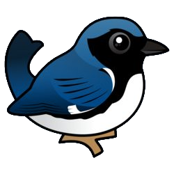

<div id="top"></div>

<!-- https://www.markdownguide.org/basic-syntax/#reference-style-links
-->
[![Contributors][contributors-shield]][contributors-url]
[![Forks][forks-shield]][forks-url]
[![Stargazers][stars-shield]][stars-url]
[![Issues][issues-shield]][issues-url]
[![LinkedIn][linkedin-shield]][linkedin-url]


<!-- PROJECT LOGO -->
<br />
<div align="center">
<a href="https://github.com/calebthewood/flask-warbler">
    
</a>

<h1 align="center">Warbler</h1>

<a href="https://github.com/calebthewood/flask-warbler">
    
</a>

  <p align="center">
    A twitter clone, built in Python-Flask.
<br />
<br />
    <a href="https://r-warble.herokuapp.com/">View Demo</a>
    ·
    <a href="https://github.com/calebthewood/flask-warbler/issues">Report Bug</a>
    ·
    <a href="https://github.com/calebthewood/flask-warbler/issues">Request Feature</a>
  </p>
</div>


<!-- TABLE OF CONTENTS -->
<details>
  <summary>Table of Contents</summary>
  <ol>
    <li>
      <a href="#about-the-project">About The Project</a>
      <ul>
        <li><a href="#built-with">Built With</a></li>
      </ul>
    </li>
    <li>
      <a href="#getting-started">Getting Started</a>
    </li>
    <li><a href="#usage">Usage</a></li>
    <li><a href="#roadmap">Roadmap</a></li>
    <li><a href="#contact">Contact</a></li>
    <li><a href="#acknowledgments">Acknowledgments</a></li>
  </ol>
</details>


<!-- ABOUT THE PROJECT -->
## About The Project


Warbler is a paired-down twitter clone I developed while attending Rithm School. The a non-functional skeleton of the app was provided, and my primary goal was to implement the database tables and relationships needed to support users, follows, likes, and messages. Since then I've continued to add to and refine the app.


<p align="right">(<a href="#top">back to top</a>)</p>


### Built With

* [Flask](https://flask.palletsprojects.com/en/2.1.x/)
* [SQLAlchemy](https://www.sqlalchemy.org/)
* [WTForms](https://wtforms.readthedocs.io/en/3.0.x/)
* [Jinja](https://palletsprojects.com/p/jinja/)
* [PostreSQL](https://www.postgresql.org/)
* [JWT](https://jwt.io/)
* [Bootstrap](https://getbootstrap.com)
* [JQuery](https://jquery.com)


<p align="right">(<a href="#top">back to top</a>)</p>


<!-- GETTING STARTED -->
## Getting Started

The following commands will work to setup project on mac zsh command line:

```
$ git clone https://github.com/calebthewood/flask-warbler.git
```
Create a .env file to hold configuration:
```
SECRET_KEY=abc123
DATABASE_URL=postgresql:///warbler
```
```
$ python3 -m venv venv
$ source venv/bin/activate
(venv) $ pip install -r requirements.txt
```

```
$ psql
  CREATE DATABASE warbler
  (ctrl-d to exit psql)
```
```
(venv) $ ipython
In [1]: from dotenv import load_dotenv
In [1]: load_dotenv()  # take environment variables from .env.
In [1]: %run seed.py
```
```
(venv) $ flask run -p 5001
```


<!-- USAGE EXAMPLES -->
## Usage

*WIP*

DB table summary:
  - follows: a through table with foreign keys from users, user_being_followed and user_following, comprising the table's composite key.
  - likes: a through table with foreign keys from users and messages where each record represents a single user's "like" of a message.
  - users: table storing data regarding user, model includes joins for follows, followers, likes, and messages
  - messages: table storing messages with a join on users.


Security:
- authentication: JWT
- encryption: bcrypt
- CSRF protection: WTForms

<p align="right">(<a href="#top">back to top</a>)</p>


<!-- ROADMAP -->
## Roadmap

- [ ] Custom 404 page
- [x] Add AJAX
    - [x] liking a warble
    - [x] post msg modal
- [ ] DRY up things
    - [ ] Templates
    - [ ] Authorization
    - [ ] URLs
- [ ] Optimize Queries
- [ ] Make a change pswd form
- [ ] Allow “Private” Accounts
- [ ] Add Admin Users
- [ ] User Blocking
- [ ] Direct Messages


See the [open issues](https://github.com/calebthewood/flask-warbler/issues) for a full list of proposed features (and known issues).

<p align="right">(<a href="#top">back to top</a>)</p>


<!-- CONTACT -->
## Contact

I'm Caleb, Web Developer and Fullstack Enginner. Questions?
- I post daily on twitter: [@calebthewood](https://twitter.com/calebthewood)
- Personal Site: [calebwood.dev](https://www.calebwood.dev/)
- email: calebwood.cs@gmail.com

<p align="right">(<a href="#top">back to top</a>)</p>


<!-- ACKNOWLEDGMENTS -->
## Acknowledgments

* [Rithm School](https://www.rithmschool.com/)
* [FontAwesome](https://fontawesome.com/v5)


<p align="right">(<a href="#top">back to top</a>)</p>


<!-- MARKDOWN LINKS & IMAGES -->
<!-- https://www.markdownguide.org/basic-syntax/#reference-style-links -->
[contributors-shield]: https://img.shields.io/github/contributors/calebthewood/flask-warbler.svg?style=for-the-badge
[contributors-url]: https://github.com/calebthewood/flask-warbler/graphs/contributors
[forks-shield]: https://img.shields.io/github/forks/calebthewood/flask-warbler.svg?style=for-the-badge
[forks-url]: https://github.com/calebthewood/flask-warbler/network/members
[stars-shield]: https://img.shields.io/github/stars/calebthewood/flask-warbler.svg?style=for-the-badge
[stars-url]: https://github.com/calebthewood/flask-warbler/stargazers
[issues-shield]: https://img.shields.io/github/issues/calebthewood/flask-warbler.svg?style=for-the-badge
[issues-url]: https://github.com/calebthewood/flask-warbler/issues
[license-shield]: https://img.shields.io/github/license/calebthewood/flask-warbler.svg?style=for-the-badge
[license-url]: https://github.com/calebthewood/flask-warbler/blob/master/LICENSE.txt
[linkedin-shield]: https://img.shields.io/badge/-LinkedIn-black.svg?style=for-the-badge&logo=linkedin&colorB=555
[linkedin-url]: https://linkedin.com/in/caleb-wood-440b37168
[product-screenshot]: https://s3.us-west-1.amazonaws.com/pix.ly/warbler.png
